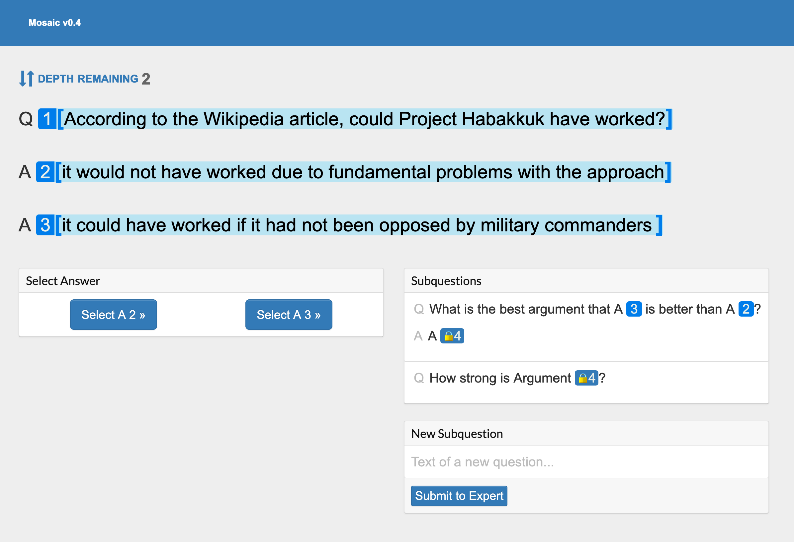

# Mosaic

Mosaic is a web app for recursive question-answering with pointers.



This is an alpha version with bugs, missing features, and usability issues.

## Setup

1. Install [Docker](https://www.docker.com/community-edition#/download)
2. Run `docker-compose up` in the root folder

On first run, you might have to call `migrate` to initialize the database:

```
docker exec -it mosaic_api_1 bash
> cd /data
> node_modules/.bin/sequelize db:migrate
```

## Testing

To run the backend tests, attach a shell to the Docker `api` service:

```
docker exec -it mosaic_api_1 bash
cd /data
yarn test
```

## Development

The code is written in [Typescript](https://www.typescriptlang.org/), but much of it is not correctly annotated. We use [Prettier](https://github.com/prettier/prettier) for code formatting.

### Offline development

Mosaic uses Auth0 for authentication, which means you will not be able to login without internet access, even while developing locally. To get around this, follow these steps:

- login with internet access
- open your localStorage (google how to do this for your browser)
- save your `user_id` and `access_token` values

Now when you try to login in the future while offline, enter these values in your browser on localhost:3000, refresh the page, and you will be logged in.

## Deployment

The app is deployed on Heroku.

To create a development build on your branch, create a pull request. A link to a development build with the latest version of your branch will be on your PR page.

When a branch is merged into master, CI runs. If the CI passes, the main deploy is updated automatically. Configure this setting at https://dashboard.heroku.com/apps/mosaic-prod/deploy/github.

Note that `docker-compose.yml` and `package.json` at the root level must be kept in sync.

## PR review

All code changes should be made via PRs (as opposed to e.g. via just pushing to master). The PR process is:

1. PR author makes the PR on Github and assigns Zak as a reviewer, plus anyone else they'd like to review the PR
2. Zak (and any other reviewers) review the PR. Either:
   a. The reviewer suggests (more) changes (proceed to step 3).
   b. The reviewer OKs the PR and notifies the author (proceed to step 4)
3. PR author makes changes based on the review comments, then notifies the reviewer (proceed to step 2)
4. The author (NOT reviewer) merges the PR

## Support

Mosaic uses Intercom for chat support. Login and enter https://app.intercom.io/a/apps/gmkvd6s1/inbox to view the latest messages.
