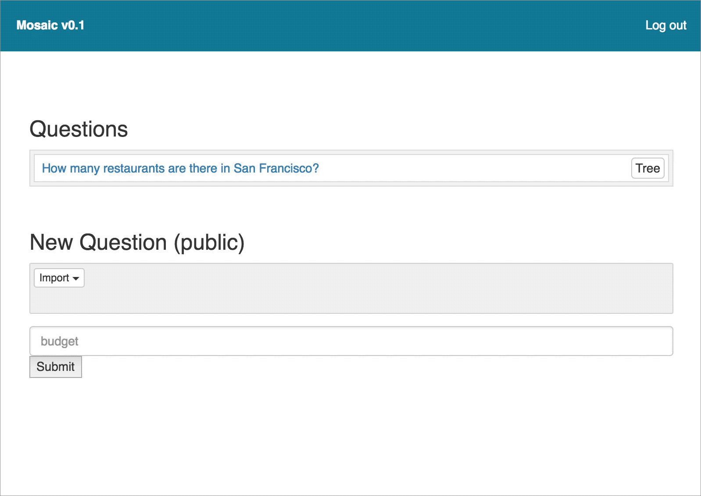

# Mosaic 

Mosaic is a web app for recursive question-answering with pointers.



This is an alpha version with bugs, missing features, and usability issues (some visible in the screencast above).

## Setup

1. Install [Docker](https://www.docker.com/community-edition#/download)
2. Run `docker-compose up` in the root folder

On first run, you might have to call `migrate` to initialize the database:

```
docker exec -it mosaic_api_1 bash
> cd /data
> node_modules/.bin/sequelize db:migrate
```

## Testing

To run the backend tests, attach a shell to the Docker `web` service:

```
docker exec -it mosaic_web_1 bash
cd /data/server
yarn test
```


## Development

The code is written in [Typescript](https://www.typescriptlang.org/), but much of it is not correctly annotated. We use [Prettier](https://github.com/prettier/prettier) for code formatting.


## Deployment

The app is deployed on Heroku.

To create a development build on your branch, create a pull request. A link to a development build with the latest version of your branch will be on your PR page. 

When a branch is merged into master, the main deploy is updated automatically.

Note that `docker-compose.yml` and `package.json` at the root level must be kept in sync.


## Saving and restoring the database

Since the app doesn't currently support import/export of individual question-answer trees, it can be helpful to save and restore the entire database.

### Saving

1. If the app is not running, run it (`docker-compose up`)
2. `cd server`
3. `scripts/dumpDB.sh` with a filepath for your dump, e.g. `scripts/dumpDB.sh ./dbDumps/myDump.db`

### Restoring

1. If the app is not running, run it (`docker-compose up`)
2. Close all external connections to the database (e.g. from pgadmin)
3. `cd server`
4. `scripts/restoreDB.sh` with a filepath for the dump you're restoring, e.g. `scripts/restoreDB.sh ./dbDumps/myDump.db`

### Troubleshooting

- One error case is that the scripts attempt to connect to the db with your system username, which probably won't work. If this happens, it's probably b/c you have an open connection to the db other than the script. (For some reason this causes the scripts to ignore the configs that you pass in and attempt to connect as the "default" user, which is your system user.) Perhaps you're running a tool like pgadmin or PSequel. Obviously the fix is to kill those other connections and try again.
- Relatedly, you may get this error if you try to restore the DB while the code is recompiling: `ERROR: database "mosaic_dev" is being accessed by other users`. If you do, wait until the code is done compiling and try again.

### Autodump

To automatically create new dumps when the db changes:
1. If the app is not running, run it (`docker-compose up`)
2. `cd server`
3. `scripts/autodump.sh` with a filepath for the directory to save the dumps to and the number of seconds to wait between checking whether the db has changed, e.g. `scripts/autodump.sh autodumps 30`


